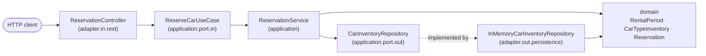
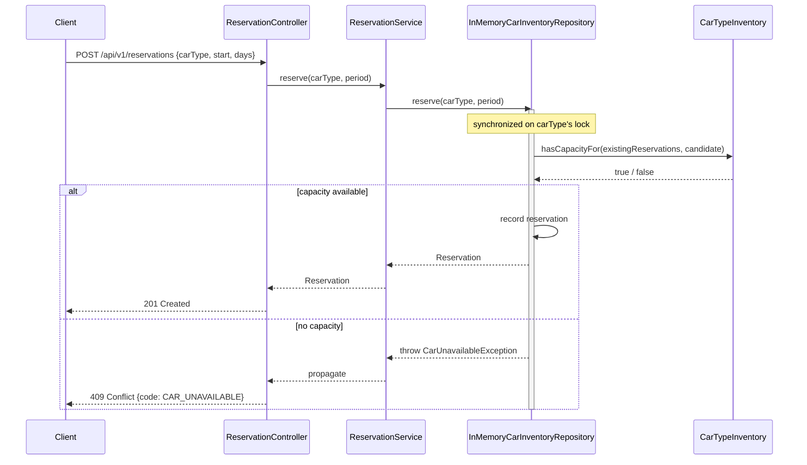
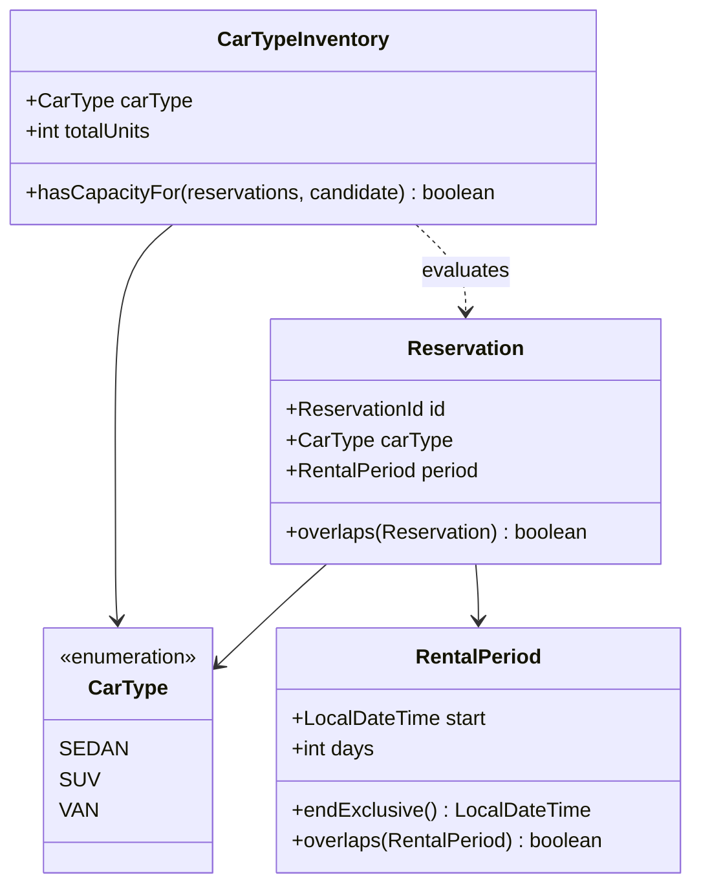

# Architecture

## Why lightweight Hexagonal

Evaluated against plain layered, not defaulted to — the classic Hexagonal trigger (multiple real
integrations, one mocked/swappable) doesn't strictly apply here, since there's exactly one real
boundary (in-memory storage). It's still worth it at near-zero incremental cost: a named port + one
adapter buys a clean separation between the reservation business rule and the concurrency-control
mechanism that enforces it. Full evaluation: [ADR 0001](decisions/0001-use-lightweight-hexagonal-architecture.md).

## Package layout



```text
eu.cleankod.carrental
  domain                  -- CarType, RentalPeriod, Reservation, CarTypeInventory, domain exceptions
  application
    port.in               -- ReserveCarUseCase
    port.out              -- CarInventoryRepository
    (service impl)         -- ReservationService
  adapter
    in.rest                -- ReservationController, request/response DTOs, RestExceptionHandler
    out.persistence         -- InMemoryCarInventoryRepository (concurrency-safe: per-car-type locking)
  config                    -- CarRentalConfiguration, FleetProperties
```

Dependencies point inward: adapters depend on application ports, application depends on domain — never
the reverse. `CarInventoryRepository` is the one deliberate port: it hides *how* atomicity is achieved
from the domain/application layers entirely.

## Request flow



The check-then-record step is the atomicity boundary: `CarInventoryRepository.reserve` is one method,
not split into separate read/write calls, so a concrete implementation can make the whole thing atomic.
`InMemoryCarInventoryRepository` does this with a dedicated lock per `CarType` — see
[ADR 0002](decisions/0002-use-per-car-type-locking-for-atomic-allocation.md).

## Domain model



- **`RentalPeriod`** is a half-open interval `[start, start + days)` — two periods that only touch at
  the boundary don't overlap, so back-to-back reservations of the same car are allowed.
- **`CarTypeInventory`** is the limited-inventory rule itself: a candidate reservation is accepted iff the
  maximum number of reservations simultaneously active at any instant — existing reservations plus the
  candidate — never exceeds `totalUnits`, computed with a sweep over start/end events. Provably optimal
  for this problem shape, but doesn't assign a specific vehicle to each reservation — see the class
  Javadoc and the README's limitations section.
- All four types are immutable records; invariant violations throw a domain-specific exception
  (`InvalidRentalPeriodException`, `InvalidFleetSizeException`, `CarUnavailableException`) rather than a
  generic JDK one.
